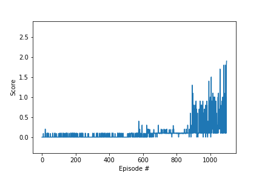

This report presents a solution to the Collaboration and Competition project in the Udacity Deep Reinforcement Learning Nanodegree. 

## Problem Statement

The following is taken from the course materials:

>In this environment, two agents control rackets to bounce a ball over a net. If an agent hits the ball over the net, it receives a reward of +0.1.  If an agent lets a ball hit the ground or hits the ball out of bounds, it receives a reward of -0.01.  Thus, the goal of each agent is to keep the ball in play.
>
>The observation space consists of 8 variables corresponding to the position and velocity of the ball and racket. Each agent receives its own, local observation.  Two continuous actions are available, corresponding to movement toward (or away from) the net, and jumping. 
>
>The task is episodic, and in order to solve the environment, your agents must get an average score of +0.5 (over 100 consecutive episodes, after taking the maximum over both agents). Specifically,
>
>- After each episode, we add up the rewards that each agent received (without discounting), to get a score for each >agent. This yields 2 (potentially different) scores. We then take the maximum of these 2 scores.
>- This yields a single **score** for each episode.
>
>The environment is considered solved, when the average (over 100 episodes) of those **scores** is at least +0.5.

  

<!-- https://gist.github.com/DavidWells/7d2e0e1bc78f4ac59a123ddf8b74932d -->

  <em> <b> Fig. 1. </b> Two rackets bouncing a ball over a net.</em>

This repository presents a solution in 1098 episodes using a Deep Deterministic Policy Gradient approach. The two agents train with the same actor and critic. The code and network architectures are adapted from a Udacity-supplied solution to the OpenAI-gym Pendulum environment. It closely reflects the solution to the [Navigation](https://github.com/frankgolub/DRLND_Reacher_Project_2) project. Fig. 1 depicts two rackets bouncing a ball over a net. Videos before and after training can be seen [here](https://youtu.be/9ZIt3VUNL0Q) and [here](https://youtu.be/gHI-Z6XIuKY) respectively. Fig. 2 shows the score increasing stochastically as the model trains.

The network trains in 7 min. 41 s. using an Intel i9-9900K 8-core CPU, 64 GB of RAM, and an 11GB NVIDIA 2080 TI GPU.

  

  <em> <b> Fig. 2. </b> The average score between episodes 999 and 1098 is 0.51.</em>

## Deep Deterministic Policy Gradient 

Given a state **s**, a DDPG trains two networks, an actor and a critic, off-policy to deterministically estimate the continuous action **a** and the action-value function **Q**, respectively, that  maximize the expected discounted reward. The reward obtained after taking action **a** is used to calculate the gradient of the critic, and this gradient is used to calculate the gradient of the actor. For training, experiences are buffered, randomized, and batched together. Google DeepMind introduced the concept of a [DDPG](https://arxiv.org/abs/1509.02971) in 2016.

### Network Architectures and Hyperparameters

The input to the architecture of the actor is a 33-element state vector. This architecture consists of a 33 x 400 fully-connected layer, a batch-normalization function, a relu activation function, a 400 x 300 fully-connected layer, a relu activation function, a 300 x 2 fully-connected layer, and a tanh activation function. The weights of the last fully-connected layer are initialized randomly in the range [-3e-3, 3e-3].

The input to the architecture of the critic is the same 33-element state vector. This architecture also consists of a 33 x 400 fully-connected layer, a batch-normalization function, and a relu activation function. However, the output of this relu function is concatenated with the 2-element action-value estimated from the first architecture to make a 402-element vector. Applied to this vector is a 402 x 300 fully-connected layer, a relu-activation function, and a 300 x 1 fully-connected layer. The weights of the last fully-connected layer are also initialized randomly in the range [-3e-3, 3e-3].

Key hyperparameters that represent the networks include buffer size (1e6), batch size (128), discount factor (0.99), and tau (1e-3). The networks use Adam for gradient descent. To explore the environment, the networks did not learn for the first 500 episodes, as the states and rewards resulting from random actions were added to the buffer. The learning rates of both the critic and the actor were set to 1e-3 for the next 400 episodes and 1e-6 for the remaining 198. 

At each time step, both agents simultaneously add their experiences to the same replay buffer, but the regular weights of both networks update only once. The previous weights of the target network add to the updated weights of the regular network by the ratio of tau:(1 - tau) to form the new weights of the target network.

## Lesson Learned

The environment should be explored before being exploited. Here, the networks learned after exploring the state space for 500 episodes. The networks did not learn in the absence of this step.

## Future Work

[Lowe et. al.](https://papers.nips.cc/paper/7217-multi-agent-actor-critic-for-mixed-cooperative-competitive-environments.pdf) proposed a modified version of DDPG that could be applied to this environment. Instead of both agents learning the same policy, each agent would learn a separate policy. Thus, each agent would have its own separate actor and critic network. The observations of both agents and the ball would be used by both agents during training. However, during testing, each agent would only be permitted to observe its own location and that of the ball. 

This approach would answer whether the knowledge of the other agent is helpful during execution and whether potentially superfluous information assists in training.

## References

Lillicrap,  T. P.,  Hunt,  J. J.,  Pritzel,  A.,  Heess,  N.,  Erez, T., Tassa, Y., Silver, D., and Wierstra, D. [Continuous control with deep reinforcement learning](https://arxiv.org/abs/1509.02971). _arXiv preprint arXiv:1509.02971, 2016._

Lowe, R., Wu, Y., Tamar, A., Harb, J., Abbeel, P., and Mordatch, I. 2017. "[Multi-Agent Actor-Critic for Mixed Cooperative-Competitive Environments](https://papers.nips.cc/paper/7217-multi-agent-actor-critic-for-mixed-cooperative-competitive-environments.pdf)," in Advances in Neural Information Processing Systems, 6379–6390.

